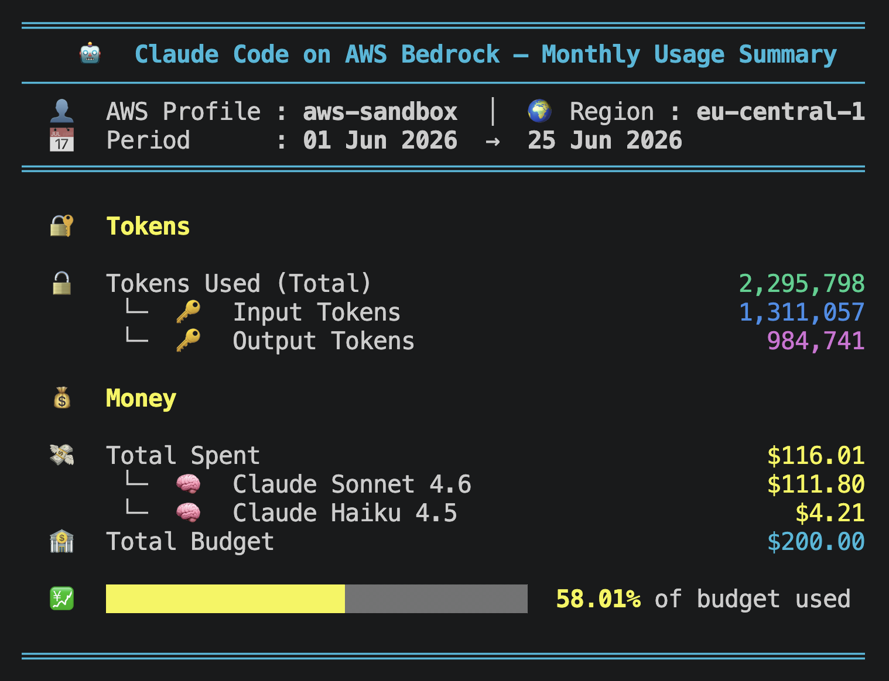

# claude-code-bedrock-usage

- Author: [Abdullah Khawer - LinkedIn](https://www.linkedin.com/in/abdullah-khawer)

# ℹ️ Introduction

A CLI tool to monitor your **Anthropic Claude Code on AWS Bedrock** usage — tokens consumed, spend per model, and budget status — for the current or any past month.

## 📊 What It Shows

- **Tokens** — total input and output tokens consumed (via CloudWatch)
- **Spend** — cost breakdown per Claude model (via Cost Explorer)
- **Budget** — total budget and percentage used (via AWS Budgets or a manual override)
- **Progress bar** — visual spend indicator that turns yellow at 50% and red at 80%

## ✅ Requirements

- Python 3.8+
- AWS CLI configured with a named profile
- IAM permissions for: `cloudwatch:GetMetricStatistics`, `ce:GetCostAndUsage`, `budgets:DescribeBudgets`, `sts:GetCallerIdentity`

## 🚀 Installation

```bash
git clone https://github.com/abdullahkhawer/claude-code-bedrock-usage.git
cd claude-code-bedrock-usage
pip install -r requirements.txt
```

## 📖 Usage

```bash
python3 claude_code_bedrock_usage.py --profile <aws-profile> [OPTIONS]
```

### ⚙️ Options

| Option | Required | Description |
|---|---|---|
| `--profile` | Yes | AWS profile name |
| `--region` | No | AWS region (default: `eu-central-1`) |
| `--budget` | No | Override total budget in USD — skips AWS Budgets lookup |
| `--month-year` | No | Month and year to query in `MM-YYYY` format (default: current month) |

### 💡 Examples

```bash
# Current month
python3 claude_code_bedrock_usage.py --profile my-profile

# Specific past month
python3 claude_code_bedrock_usage.py --profile my-profile --month-year 05-2026

# Custom region
python3 claude_code_bedrock_usage.py --profile my-profile --region us-east-1

# Override budget
python3 claude_code_bedrock_usage.py --profile my-profile --budget 500
```

### 🖥️ Sample Output



## 📌 Notes

- **Token counts** come from CloudWatch `AWS/Bedrock` metrics. These reflect on-demand input and output tokens. Prompt cache tokens are billed separately and may not appear here, so actual spend may be higher than what token counts alone would suggest.
- **Cost Explorer data** can lag by up to 24 hours.
- If no AWS Budgets exist in the account and `--budget` is not passed, the total budget will show as `$0.00`.

## 📝 License

Apache License 2.0 — see [LICENSE](LICENSE).

---

###### Any contributions, improvements and suggestions will be highly appreciated. 😊
